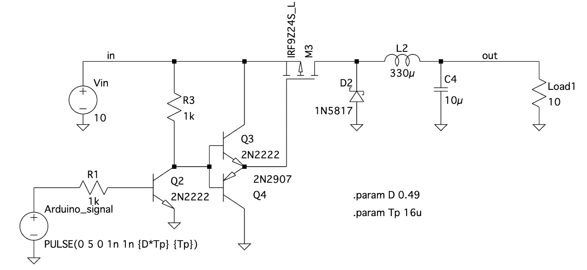
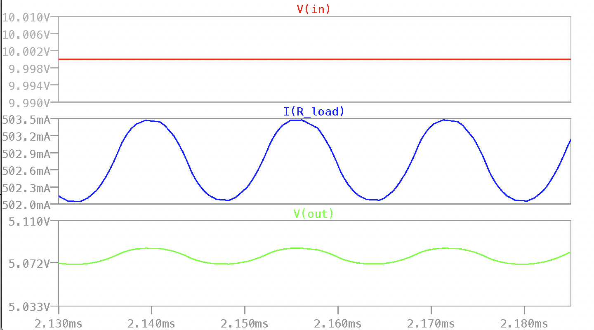
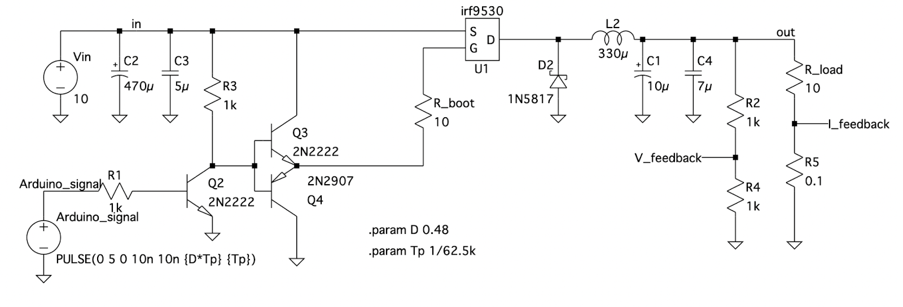
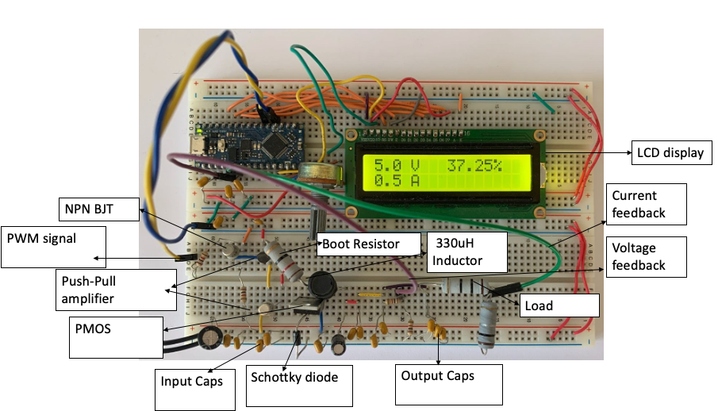
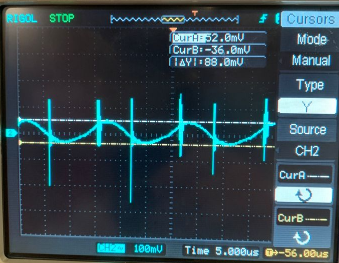
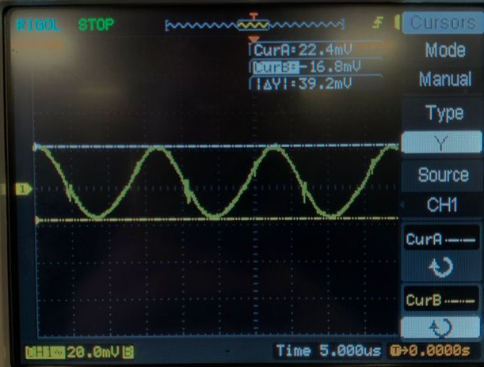

# Table of Contents

1. [Switch-mode Power Supply](#switch-mode-power-supply)
   - [Components](#components)
   - [Calculation of Duty Cycle and Switching Frequency](#calculation-of-duty-cycle-and-switching-frequency)
   - [Calculation of Output Ripple and Capacitance](#calculation-of-output-ripple-and-capacitance)
   - [Simulation Results](#simulation-results)
2. [Prototype Power Supply](#prototype-power-supply)
   - [Laboratory Results](#laboratory-results)
   - [Power Supply Specifications](#power-supply-specifications)
   - [Discussion](#discussion)
   - [Conclusions](#conclusions)
3. [References](#references)

# Switch-mode Power Supply

By Ryan Selesnik and Rachel Edelstein

This design was inspired by [a YouTube video by FesZ Electronics](https://www.youtube.com/watch?v=2LlT0-S9KvI&t=17s). 

This project involves the design and implementation of a switch-mode power supply (SMPS) for a 5V USB-based device used in a portable radio. The circuit, depicted in Figure 1, is specifically designed to maximize efficiency and is based on the Buck Converter topology.

*Figure 1: Simulation schematic diagram* 

### Components

The following components have been selected for the SMPS design, along with a brief explanation of their purpose and rationale:

1. Arduino Nano Every - This component provides the necessary PWM (Pulse Width Modulation) signal for switching operations.
2. P-channel MOSFET - It serves as the high-side switch in the circuit, enabling control of the power flow.
3. NPN BJT - The NPN BJT is utilized to drive the MOSFET, with R3 acting as a pull-up resistor.
4. Push-pull amplifier - The push-pull amplifier consists of two BJTs that alternate between absorbing and supplying current. This configuration helps reduce the rise and fall time of the switching signal, thereby minimizing total power dissipation in the MOSFET.
5. Schottky diode - The Schottky diode provides a low voltage drop path for current when the MOSFET is turned off. This choice of diode reduces power dissipation in the circuit.
6. Inductor and Capacitor - The inductor and capacitor work together to drop the voltage and store it, respectively. This mechanism contributes to minimizing heat dissipation in the circuit.
7. Capacitor - This capacitor is employed to smooth the output voltage by reducing ripple.

### Calculation of Duty Cycle and Switching Frequency

The estimated duty cycle (D) can be determined using the following formula:

$$D = \frac{V_{\text{in}}}{V_{\text{out}} \cdot \eta} \qquad \text{(1)}$$

Where $\eta$ is the efficiency. Given the values Vin = 10V and Vout = 5V, and assuming an efficiency of 90% ( $\eta = 0.90$), a reasonable choice for a Buck Converter [1], the calculated duty cycle is 0.56.

The required switching frequency (fsw) can be derived from the voltage-current relationship of the inductor. Since we know that during the off time (Toff), VL = Vout, we can express it as follows:

$$V_{\text{out}} = L \cdot \frac{\Delta I}{(1 - D) \cdot T_{\text{p}}} \qquad \text{(2)}$$

This implies:

$$f_{\text{sw}} = \frac{V_{\text{out}} \cdot (1 - D)}{L \cdot \Delta I} \qquad \text{(3)}$$

For an estimated current (I) range of 20-40% of the load current, which is 500 mA [1], assuming 20%, we can calculate the switching frequency as:

$$f_{\text{sw}} = \frac{5 \cdot (1 - 0.56)}{330 \cdot 0.2 \cdot 0.5} = 67 \text{ kHz} \qquad \text{(4)}$$

Considering that the Arduino Nano Every has a maximum switching frequency of 62.5 kHz, we choose fsw = 62.5 kHz.

### Calculation of Output Ripple and Capacitance

To achieve an output ripple of 1%, the capacitance (C) can be calculated using the following equation:

$$C = \frac{\Delta I}{8 \cdot f_{sw}\cdot \Delta V }= \frac{0.1}{8(62.5\text{k})(0.01)(5)}=4\ \mu F
 \qquad \text{(5)}$$

This value represents the minimum required capacitance, and choosing 10 μF will provide more than sufficient smoothing [1].

### Simulation Results

Using the circuit depicted in Figure 1 above, simulations were conducted to evaluate the functionality of the circuit. The expected load current is approximately 500mA, which is successfully achieved, as demonstrated in Figure 2 below. Furthermore, the output voltage is expected to be around 5V with a maximum allowable ripple of 1%. By employing a 10μF capacitor, the ripple can be determined from the graph below, yielding a value of 0.48%, surpassing the specified requirement.

*Figure 2. Simulated results*

## Prototype Power Supply

Below are the circuit diagram and picture of the final prototype in Figure 3 and Figure 4 respectively. Since the construction of the circuit in LTspice and the initial simulations, the circuit has been enhanced by the addition of certain components to reduce parasitic effects and output ripple. This circuit also incorporates a feedback mechanism to regulate the output voltage.

*Figure 3: Final prototype schematic diagram*

*Figure 4: A labelled diagram of the final prototype power supply with 12V DC input*

### Laboratory Results

The following photographs in Figure 5 represent the laboratory results obtained before and after introducing improvements to the circuit, such as ceramic capacitors to decrease the output ripple and a boot resistor to reduce switching noise [3]. Table 1 below provides a comparison between the expected and actual results.

**Figure 5.1: 5V output with 1.76% ripple without ceramic output capacitors.**

**Figure 5.2: 5V voltage with 0.8% ripple with ceramic output capacitors.**

**Table 1: Comparison of simulated results and improved laboratory results**

|               | Simulated Results | Final Laboratory Results |
|---------------|------------------|--------------------------|
| Output ripple (%) | 0.48             | 0.80                     |
| Output voltage (V) | 5.00             | 5.10                     |
| Efficiency (%) | 89               | 83                       |

###  Power Supply Specifications

Table 2 illustrates the overall performance and rated measurements of the prototype. It can be observed that the 5V DC output requirement is met, as shown in Figure 5.2 in the Laboratory Results section.

**Table 2: The power supply prototype specifications**

|                    |                   |
|--------------------|-------------------|
| Efficiency (%)     | 83                |
| Input voltage (V)  | 10                |
| Rated current (mA) | 500               |
| Rated voltage (V)  | 5                 |
| Switching frequency (kHz) | 62.5       |
| Rated power (W)    | 2.5               |
| Output voltage ripple (%) | 0.8           |

### Discussion

In the simulation, a single capacitor of 10μF was used to decrease the output ripple. However, in the prototype, a larger capacitance of 17μF was required to achieve the desired ripple of 1%. Additionally, switching noise from the MOSFET appears on the output, which was not expected since it was absent in the simulation. The noise is present in the prototype due to parasitic effects, such as wire inductance.

Due to spatial limitations on the breadboard and the abundance of components, ceramic capacitors were introduced to assist in reducing these parasitic effects. Ceramic capacitors are better at filtering higher-frequency noise and significantly decrease the output ripple voltage, as observed in Figure 5 [2]. Furthermore, a boot resistor was placed at the gate of the MOSFET to slow down the rise time of the switching signal and thus reduce the switching noise on the output [3].

Including a larger gate resistor further limits high frequencies but also contributes to unwanted power dissipation. Therefore, a trade-off was made in this regard. Additionally, utilizing low-side switching results in a floating ground, which introduces difficulty in reading the voltage due to the Arduino and the load having different grounds. For this reason, high-side switching was implemented.

A strength of the circuit is the implemented feedback mechanism, which adjusts the duty cycle according to the output voltage. This prevents the voltage (and subsequently the current) from becoming dangerously high. This characteristic of the circuit is successful, as the voltage responds well to the varying duty cycle.

To improve the prototype, current-limiting logic could be implemented in software.

### Conclusions

The design and implementation of this power supply required extensive calculations and testing to meet the requirements of a 5V DC power supply with a ripple of less than 1%. The inclusion of ceramic capacitors helped decrease the ripple to the desired specification, while the feedback mechanism aided in regulating the output. Multiple trade-offs were made to balance efficiency with unwanted parasitic effects.

## References

[1] Lee, J. (2015). Basic calculation of a buck converter’s power stage. In Application Note AN041 (pp. 1-8). Richtek Technology Corporation.

[2] Miftakhutdinov, R. (2005). Compensating DC/DC converters with ceramic output capacitors. Texas Instruments.

[3] Hubbard, D. (2018). Reducing noise on the output of a switching regulator. Texas Instruments.
